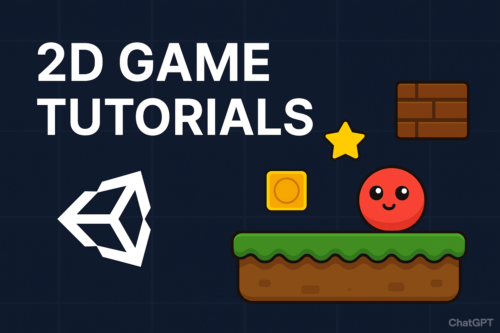
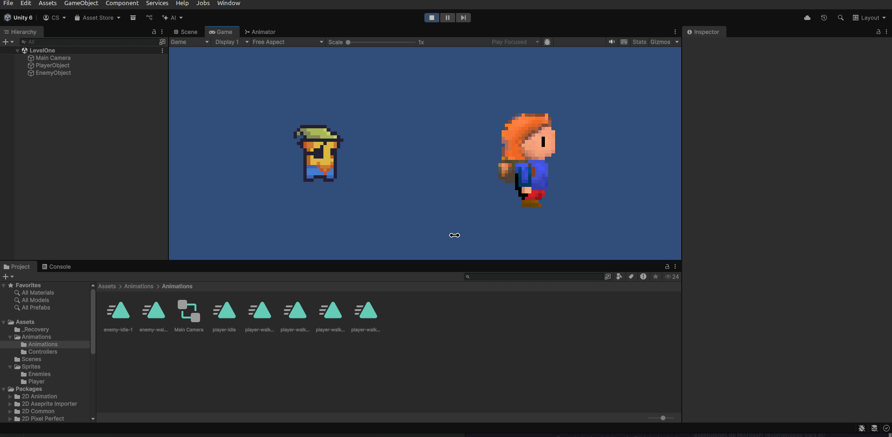

# 🎮 Unity 2D Tutorials

Bienvenido a este repositorio de **tutoriales paso a paso con Unity 2D**.  
Aquí encontrarás ejemplos prácticos, código fuente, documentación y recursos para aprender a crear videojuegos en 2D con **Unity + C#**.

---

## 📂 Estructura del repositorio
```
TUTORIALS_2D/
│
├── README.md               # Este archivo
└── tutorials/              # Carpeta principal de tutoriales
    ├── Tutorial01/
    │   ├── README.md       # Explicación del tutorial paso a paso
    │   ├── src/            # Scripts C# del tutorial
    │   ├── Assets/         # Sprites/tilesets creados para el tutorial
    │   └── progress/       # Capturas y gifs de progreso
    └── ...
```

Cada carpeta dentro de `tutorials/` corresponde a un proyecto o lección independiente.  
En cada tutorial encontrarás:
- 📜 Un `README.md` con explicación paso a paso.  
- 💻 Scripts en C# dentro de `src/`.  
- 🎨 Sprites, tiles y recursos en `Assets/`.  
- 🖼️ Capturas de pantalla o gifs en `progress/`.  

---

## 📚 Lista de tutoriales
| N° | Tutorial | Descripción | Assets | Video |
|----|----------|-------------|--------|-------|
| 01 | Movimiento Básico | Aprende a mover un personaje en 2D con C# y teclado. | [Ver assets](./tutorials/Tutorial01/Assets/) | [Ver video](./tutorials/Tutorial01/progress/Tutorial1.gif)
| 02 | Movimiento en los 4 sentidos | Aprende a mover a un personaje en los 4 sentido posibles (arriba, abajo, izquierda, derecha) y a crear el escenario donde caminará tipo pokemon | [Ver assets](./tutorials/Tutorial02/Assets/) | [Ver video](./tutorials/Tutorial02/progress/Tutorial2.gif)

---

## 🛠️ Requisitos
- [Unity Hub](https://unity.com/download) con Unity 2021 o superior.  
- Conocimientos básicos de C# (nivel principiante está bien).  
- Editor de código recomendado: [Visual Studio Code](https://code.visualstudio.com/) o [Visual Studio Community](https://visualstudio.microsoft.com/es/).

---

## 🚀 Cómo usar este repositorio
1. Clona el repositorio:  
   ```bash
   git clone https://github.com/tuusuario/Unity2D-Tutorials.git
   ```
2. Abre Unity y selecciona la carpeta del tutorial que quieras seguir.  
3. Revisa el `README.md` del tutorial para seguir los pasos.  

---

## 🖼️ Ejemplo visual



---

## 📌 Organización y mejoras
Este repositorio está organizado para que puedas:  
- 📖 Aprender con documentación clara y ejemplos.  
- 📝 Abrir *issues* para sugerir nuevos tutoriales o reportar errores.  
- ⭐ Usar este repo como referencia en tu portafolio de proyectos.  

---

## 📜 Licencia
El código fuente está bajo la licencia [MIT](https://opensource.org/licenses/MIT).  
Los assets gráficos (sprites, tilesets) creados para estos tutoriales tienen licencia [CC0](https://creativecommons.org/publicdomain/zero/1.0/), salvo que se indique lo contrario en cada tutorial.  

---

## 👤 Autor
Creado con ❤️ por **Ismael Prado**  
Si te gusta este contenido, considera darle una ⭐ al repo para apoyar el proyecto.  